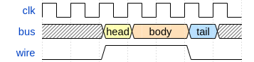

# Joplin Plugin WaveDrom
This plugin allows you to create WaveDrom diagrams as defined by https://wavedrom.com/.


## Installation

### Automatic Installation
Search for "wavedrom" in the Joplin plugin manager.

### Manual Installation
1. Download the latest release from GitHub
2. Open `Joplin > Options > Plugins > Install from File`
3. Select the jpl file downloaded from GitHub

## Markdown Syntax
Example syntax:

    ```wavedrom
    {signal: [
      {name: "clk",  wave: "p......"},
      {name: "bus",  wave: "x.34.5x",   data: "head body tail"},
      {name: "wire", wave: "0.1..0."},
    ]}
    ```

Produces:



## Building
The plugin may be built with:
```
npm run dist
```
This will generate a jpl file in the publish directory.

